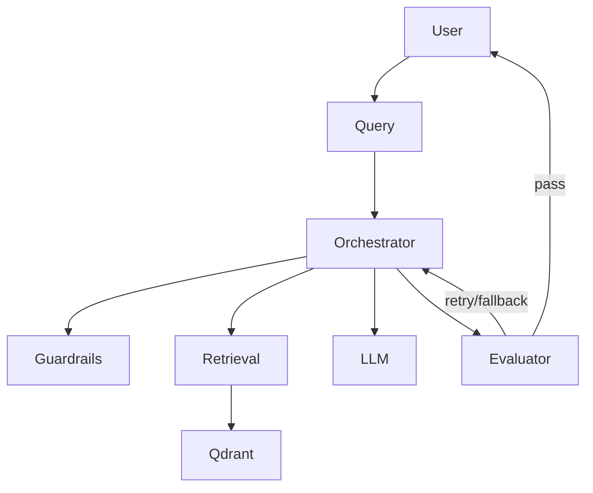

# Medical Chatbot

Medical chatbot prototype with RAG retrieval, safety guardrails, LLM routing, and phased architecture migration.

## Current Architecture



## Project Entrypoint

Unified CLI:

```bash
python run.py --help
```

Available commands:
- `chat`: interactive chatbot loop
- `ingest`: ingest datasets into Qdrant
- `eval`: evaluation smoke check

## Setup

1. Create virtualenv and install dependencies:

```bash
python -m venv venv
venv\Scripts\activate
pip install -r requirements.txt
```

2. Configure environment variables (`.env`):

```env
LLM_PROVIDER=openai
OPENAI_API_KEY=your_key_here
QDRANT_URL=http://localhost:6333
QDRANT_COLLECTION=medical_docs
DATASET_JSON_PATH=data/dataset/disease_database.json
DATASET_CSV_PATH=data/dataset/dataset_sheet1.csv
LLM_TXT_PATH=llm.txt
```

## CLI Usage

### Chat

```bash
python run.py chat --top-k 3
```

Exit commands in chat loop: `exit`, `quit`, `:q`.

### Ingest

```bash
python run.py ingest
```

Custom dataset paths:

```bash
python run.py ingest --json-path data/dataset/disease_database.json --csv-path data/dataset/dataset_sheet1.csv
```

### Eval Smoke

```bash
python run.py eval
```

## Validation Commands

Phase-1 validation commands used during migration:

```bash
python -c "import run; import agent.orchestrator.chat_loop; import agent.guardrail.rules_engine; import knowledge.qdrant.client; import rag.retrieval.retriever; import models.contracts; print('import-smoke-ok')"
python -c "import agents.main_agent, llm_hub.router, ingestion.embed, rag.retriever, vector_db.qdrant_client, guardrails.rules; print('legacy-shims-ok')"
python -m compileall agent knowledge rag models config run.py app.py
python -m unittest tests.test_models tests.test_cli tests.test_config_prompts tests.test_phase1_structure -v
```

## Data Layout

Canonical dataset location:
- `data/dataset/disease_database.json`
- `data/dataset/dataset_sheet1.csv`

## Documentation

- Backlog: `docs/backlog.md`
- Tracker: `docs/backlog-tracker.md`
- PRD: `docs/prd.md`
- Phase-1 migration plan: `docs/p1-migration-plan.md`
- Shim register: `docs/p1-shim-register.md`
- Import validation: `docs/p1-import-validation.md`
- Model inventory: `docs/p1-model-inventory.md`
- Model guidelines: `docs/p1-model-guidelines.md`

