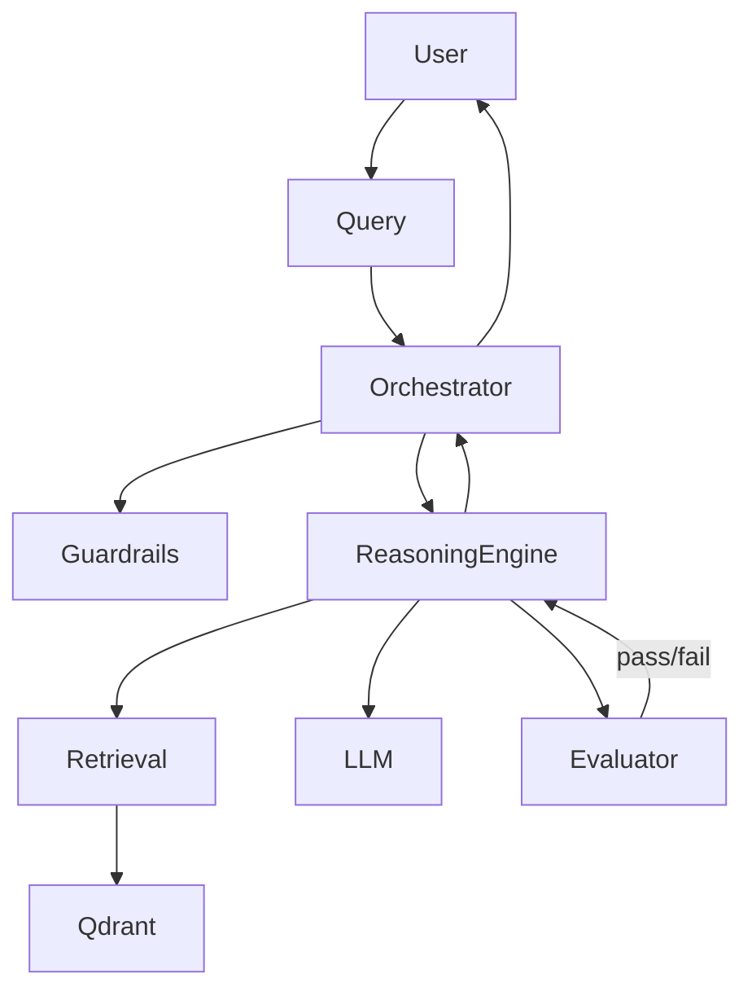

# Medical Chatbot

Medical chatbot prototype with RAG retrieval, safety guardrails, LLM routing, and phased architecture migration.

## Current Architecture



## Project Entrypoint

Unified CLI (single entrypoint):

```bash
python run.py --help
```

Available commands:
- `chat`: interactive chatbot loop
- `ingest`: ingest datasets into Qdrant
- `eval`: evaluation smoke check

## Setup

1. Create virtualenv and install dependencies:

```bash
python -m venv venv
venv\Scripts\activate
pip install -r requirements.txt
```

2. Configure environment variables (`.env`):

```env
LLM_PROVIDER=openai
OPENAI_API_KEY=your_key_here
QDRANT_URL=http://localhost:6333
QDRANT_COLLECTION=medical_docs
DATASET_JSON_PATH=data/dataset/disease_database.json
DATASET_CSV_PATH=data/dataset/dataset_sheet1.csv
LLM_TXT_PATH=llm.txt
RETRIEVAL_MIN_SCORE=0.2
```

## CLI Usage

### Chat

```bash
python run.py chat --top-k 3
```

Graph-hybrid chat mode:

```bash
python run.py chat --retrieval-mode hybrid --graph-depth 2 --vector-weight 1.0 --graph-weight 0.7
```

Exit commands in chat loop: `exit`, `quit`, `:q`.

### Ingest

```bash
python run.py ingest
```

Enable graph ingestion (Kuzu) from PDF chunks:

```bash
python run.py ingest --graph-ingest --relation-min-confidence 0.7
```

Custom dataset paths:

```bash
python run.py ingest --json-path data/dataset/disease_database.json --csv-path data/dataset/dataset_sheet1.csv
```

Direct markdown ingest (for example cleaned `document.md`):

```bash
python run.py ingest --markdown-path output/document.md --pdf-only
```

### Evaluation & Benchmark

Quick evaluator smoke check (no benchmark file):

```bash
python run.py eval
```

Full retrieval benchmark against the grile dataset (writes metrics to an output file):

```bash
python run.py eval \
    --benchmark \
    --benchmark-output output/output_v20_40o.txt
```

Useful optional flags:
- `--benchmark-top-k` – override retriever top_k during benchmark (default: `DEFAULT_TOP_K`).
- `--benchmark-limit` – limit number of benchmark items (0 = toate).
- `--benchmark-use-guardrail` – when `true`, păstrează guardrail-ul activ și în benchmark (implicit este dezactivat pentru scoruri mai clare).

## Docker Usage

Build image:

```bash
docker build -t medical-chatbot:local .
```

Run compose stack (app + qdrant + openwebui):

```bash
docker compose up -d
docker compose ps
```

Run only API + qdrant (recommended for OpenWebUI):

```bash
docker compose up -d qdrant api
```

Run only app + qdrant (CLI flow):

```bash
docker compose up -d qdrant app
```

Enable optional local model provider profile:

```bash
docker compose --profile local-llm up -d
```

Stop and remove the stack:

```bash
docker compose down
```

OpenWebUI default URL: `http://localhost:3000`  
Qdrant API: `http://localhost:6333`  
Medical Chatbot API: `http://localhost:8000`

### OpenWebUI -> API Integration

Compose wiring now points OpenWebUI to the local adapter service:
- `OPENAI_API_BASE_URL=http://api:8000/v1`
- `OPENAI_API_KEY=${API_KEY}`

Quick validation:

```bash
curl http://localhost:8000/health
curl http://localhost:8000/v1/models
```

If API key auth is enabled:
- set `API_REQUIRE_KEY=true` and `API_KEY=<your-secret>` in `.env`
- configure the same key in OpenWebUI for the OpenAI provider

## Graph-RAG and GitNexus

Graph-related environment controls:

```env
RETRIEVAL_MODE=vector
GRAPH_RETRIEVAL_TOP_K=3
GRAPH_TRAVERSAL_DEPTH=1
HYBRID_VECTOR_WEIGHT=1.0
HYBRID_GRAPH_WEIGHT=0.9
GRAPH_INGEST_ENABLED=true
RELATION_MIN_CONFIDENCE=0.7
GITNEXUS_ENABLED=false
GITNEXUS_BASE_URL=http://localhost:8088
```

Key feature flags (true/false) and what they do:
- `GRAPH_INGEST_ENABLED` (default: `true`) – dacă este `true`, după ingest se construiește și graful Kuzu din chunk-uri și relații (Graph-RAG activ).
- `GUARDRAIL_LLM_ENABLED` (default: `true`) – activează verificările LLM-based în guardrail înainte să întoarcă răspunsul către utilizator.
- `RETRIEVAL_RERANK_ENABLED` (default: `true`) – dacă este `true`, aplică un reranker peste hit-urile inițiale din Qdrant.
- `KEYWORD_FALLBACK_ENABLED` (default: `true`) – permite fallback pe căutare keyword dacă scorul vectorial este prea mic.
- `SEMANTIC_USE_LLAMAINDEX` (default: `true`) – folosește parser-ul semantic llama-index pentru chunking când `CHUNKING_STRATEGY=semantic`.
- `ALLOW_SEMANTIC_CHUNK_FALLBACK` (default: `false`) – dacă este `true`, permite fallback pe chunking simplu atunci când semantic chunking eșuează.
- `GITNEXUS_ENABLED` (default: `false`) – când este `true`, `/graph/nexus` se conectează la GitNexus la `GITNEXUS_BASE_URL` și întoarce noduri, muchii și `source_link` pentru navigare în sursa de cunoștințe.

API-specific flags:
- `API_ENABLED` (default: `true`) – dacă este `false`, API-ul HTTP nu pornește.
- `API_REQUIRE_KEY` (default: `false`) – dacă este `true`, toate rutele protejate cer header `Authorization: Bearer <API_KEY>`.

Evaluator flags:
- `EVAL_PASS_SCORE` (default: `0.7`) – pragul minim de acceptare pentru evaluator (sub acest scor, se consideră că răspunsul a eșuat).
- `EVAL_MAX_RETRIES` (default: `2`) – câte reîncercări poate face evaluatorul (inclusiv cu fallback între provideri).

API control hooks:
- `POST /chat` and `POST /v1/chat/completions` accept `retrieval_mode`, `graph_depth`, `vector_weight`, `graph_weight`.
- `GET /graph/nexus?query=<text>&limit=<n>` returns graph nodes/edges with `source_link` fields for source chunk navigation.

Troubleshooting:
- If graph ingestion logs `Skipping graph ingestion because graph backend is unavailable.`, install/verify `kuzu` in the active environment.
- If hybrid answers do not include citation rows, ensure retrieval mode is `hybrid` (`RETRIEVAL_MODE=hybrid` or pass API/CLI override).
- If `/graph/nexus` returns `status=disabled`, set `GITNEXUS_ENABLED=true` and provide `GITNEXUS_BASE_URL`.
- If graph results are sparse, increase `GRAPH_TRAVERSAL_DEPTH` or `GRAPH_RETRIEVAL_TOP_K`.

## Validation Commands

Phase-1 validation commands used during migration:

```bash
python -c "import run; import agent.orchestrator.chat_loop; import agent.guardrail.rules_engine; import knowledge.qdrant.client; import rag.retrieval.retriever; import models.contracts; print('import-smoke-ok')"
python -m compileall agent knowledge rag models config run.py
python -m unittest tests.test_models tests.test_cli tests.test_config_prompts tests.test_phase1_structure -v
```

## Data Layout

Canonical dataset location:
- `data/dataset/disease_database.json`
- `data/dataset/dataset_sheet1.csv`

## Documentation

- Backlog: `docs/backlog.md`
- Tracker: `docs/backlog-tracker.md`
- PRD: `docs/prd.md`
- Release and demo checklist: `docs/release-demo-checklist.md`
- Final acceptance checklist (PRD-mapped): `docs/final-acceptance-checklist.md`
- Phase-1 migration plan: `docs/p1-migration-plan.md`
- Shim register: `docs/p1-shim-register.md`
- Import validation: `docs/p1-import-validation.md`
- Model inventory: `docs/p1-model-inventory.md`
- Model guidelines: `docs/p1-model-guidelines.md`


