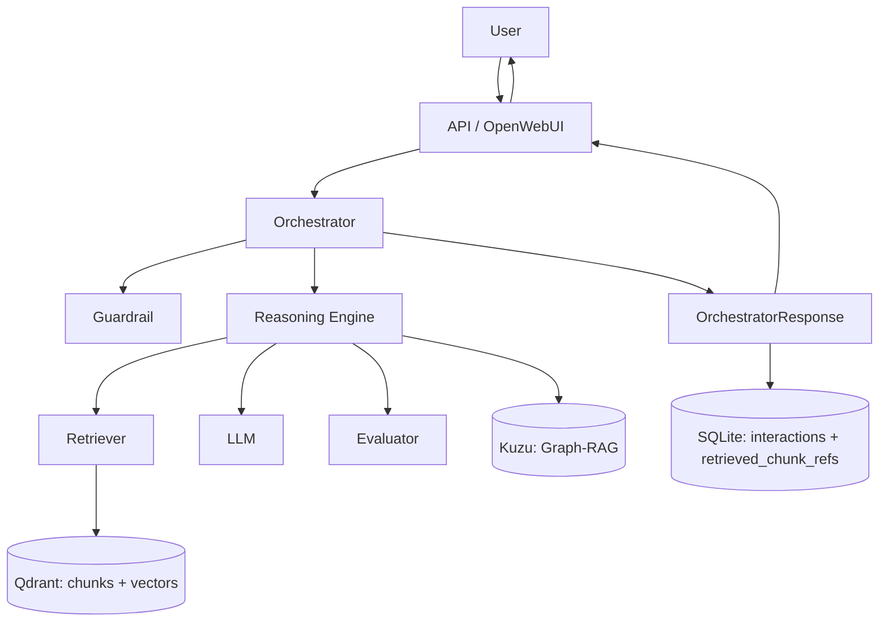

# Plan: stocarea interactiunilor si a chunk-urilor returnate

Date: 2026-05-24  
Status: Completed - Etapele 1-6 validated (2026-05-24)  
Scope: persistenta operationala pentru raspunsurile chatbotului si trasabilitatea contextului RAG

## 1. Obiectiv

Introducerea unei stocari locale simple pentru interactiunile executate de chatbot, fara a modifica responsabilitatea bazelor de cunostinte existente:

- `Qdrant` ramane sursa pentru vectori, chunk-uri si retrieval.
- `Kuzu` ramane sursa pentru entitati si relatii Graph-RAG.
- o baza `SQLite` noua pastreaza istoricul interactiunilor si ID-urile chunk-urilor returnate de retrieval.

MVP-ul trebuie sa poata raspunde la intrebarile:

1. Ce intrebare a fost adresata?
2. Ce raspuns final a returnat aplicatia?
3. Raspunsul a trecut prin guardrail si evaluator?
4. Ce model/provider a fost folosit si cate retry-uri au avut loc?
5. Ce `chunk_id`-uri au fost folosite drept context pentru raspuns?

## 2. Decizii de scope

### Inclus in MVP

- stocarea query-ului utilizatorului si a raspunsului final returnat;
- stocarea rezultatului final de guardrail si, unde exista, de evaluator;
- stocarea providerului, modelului si numarului de retry-uri;
- stocarea identificatorilor chunk-urilor returnate, impreuna cu scorul si metadate minime de provenienta;
- persistenta pentru request-urile HTTP din `/chat` si `/v1/chat/completions`;
- suport optional pentru salvarea interactiunilor din CLI, dupa validarea fluxului API;
- teste unitare pentru repository si integrarea API;
- configurare prin variabile de mediu si volum Docker persistent.

### Exclus din MVP

- folosirea istoricului pentru memorie conversationala in prompt;
- salvarea textului integral al chunk-urilor in SQLite;
- salvarea promptului intern, a instructiunilor din `llm.txt` sau a contextului RAG complet;
- salvarea raspunsurilor intermediare respinse de evaluator la retry;
- utilizatori, autentificare, profiluri medicale sau date clinice reale;
- mutarea documentelor/vectorilor din Qdrant in SQLite.

### De ce stocam doar ID-urile chunk-urilor

`chunk_id` este deja transmis in `RetrievalHit` si este legatura naturala catre continutul existent in Qdrant. Duplicarea textului chunk-ului ar creste baza operationala si ar crea doua surse care pot deveni nealiniate dupa re-ingestie.

Pentru audit minimal, se salveaza si `score`, `rank`, `source_file`, `page` si `section` daca acestea sunt disponibile la momentul raspunsului. Continutul ramane in Qdrant.

## 3. Flux tinta



Persistenta este efectuata dupa obtinerea `OrchestratorResponse`, astfel incat baza sa retina exact rezultatul expus utilizatorului, inclusiv cazurile blocate de guardrail sau fara context suficient.

## 4. Date de stocat

### 4.1 Tabel `interactions`

O linie reprezinta o executie a pipeline-ului pentru o intrebare.

| Camp | Tip SQLite | Obligatoriu | Sursa curenta |
| --- | --- | --- | --- |
| `id` | `TEXT PRIMARY KEY` | Da | UUID generat la persistenta |
| `created_at` | `TEXT` | Da | UTC ISO-8601 |
| `session_id` | `TEXT` | Nu | payload API, pregatit pentru viitor |
| `endpoint` | `TEXT` | Da | `/chat`, `/v1/chat/completions`, optional `cli` |
| `user_query` | `TEXT` | Da | `QueryRequest.query` |
| `assistant_response` | `TEXT` | Nu | `OrchestratorResponse.response` |
| `provider` | `TEXT` | Nu | `OrchestratorResponse.provider` |
| `model` | `TEXT` | Nu | `OrchestratorResponse.model` |
| `retries` | `INTEGER` | Da | `OrchestratorResponse.retries` |
| `guardrail_valid` | `INTEGER` | Da | `guardrail.is_valid` |
| `guardrail_category` | `TEXT` | Nu | `guardrail.category` |
| `guardrail_reason_code` | `TEXT` | Nu | `guardrail.reason_code` |
| `evaluator_passed` | `INTEGER` | Nu | `evaluator.passed` |
| `evaluator_score` | `REAL` | Nu | `evaluator.score` |
| `retrieval_provenance` | `TEXT` | Nu | `retrieval.provenance` |
| `retrieval_hit_count` | `INTEGER` | Da | `len(retrieval.hits)` sau `0` |

### 4.2 Tabel `retrieved_chunk_refs`

O linie reprezinta un chunk returnat pentru o interactiune, in ordinea folosita drept context.

| Camp | Tip SQLite | Obligatoriu | Observatie |
| --- | --- | --- | --- |
| `interaction_id` | `TEXT` | Da | FK catre `interactions.id` |
| `rank` | `INTEGER` | Da | pozitia hit-ului in rezultat |
| `chunk_id` | `TEXT` | Nu | ID-ul chunk-ului; poate lipsi pentru surse legacy |
| `score` | `REAL` | Da | scorul retrieval-ului |
| `source` | `TEXT` | Nu | de exemplu `pdf`, `dataset`, `graph` |
| `source_file` | `TEXT` | Nu | provenienta disponibila |
| `page` | `INTEGER` | Nu | optional pentru surse Markdown |
| `section` | `TEXT` | Nu | sectiunea sursa |

Cheie recomandata:

```sql
PRIMARY KEY (interaction_id, rank)
```

Indexuri recomandate:

```sql
CREATE INDEX idx_interactions_created_at ON interactions(created_at);
CREATE INDEX idx_chunk_refs_chunk_id ON retrieved_chunk_refs(chunk_id);
```

## 5. Componente noi si modificari anticipate

### Componente noi

| Fisier propus | Responsabilitate |
| --- | --- |
| `storage/__init__.py` | Exporturi publice pentru stocarea operationala |
| `storage/sqlite_store.py` | Initializare schema si `save_interaction(...)` |
| `tests/test_sqlite_store.py` | Teste pentru schema si persistenta atomica |

### Componente existente de ajustat

| Fisier | Modificare |
| --- | --- |
| `config/settings.py` | configurare `INTERACTION_DB_ENABLED` si `INTERACTION_DB_PATH` |
| `.env.example` | documentarea setarilor bazei operationale |
| `api/dependencies.py` | injectarea unui store usor de inlocuit in teste |
| `api/app.py` | salvarea rezultatului final pentru cele doua endpoint-uri chat |
| `agent/orchestrator/chat_loop.py` | etapa ulterioara: salvare si pentru CLI |
| `docker-compose.yml` | director/volum persistent pentru fisierul SQLite |
| `README.md` | documentarea scopului si a pornirii persistentei |
| `tests/test_api_engine_endpoints.py` | verificarea persistentei pentru `/chat` |
| `tests/test_api_openai_adapter.py` | verificarea persistentei pentru endpoint-ul OpenAI-compatible |

Nu sunt necesare modificari in:

- `knowledge/qdrant/*`;
- `knowledge/graph/*`;
- `rag/retrieval/*`;
- pipeline-ul de embeddings;
- `agent/reasoning/engine.py`.

## 6. Interfata propusa pentru store

Store-ul trebuie injectat la marginea aplicatiei si sa primeasca obiectele deja calculate:

```python
class InteractionStore:
    def save_interaction(
        self,
        *,
        request: QueryRequest,
        response: OrchestratorResponse,
        endpoint: str,
        session_id: str | None = None,
    ) -> str:
        ...
```

Reguli:

- metoda salveaza interactiunea si referintele chunk-urilor intr-o singura tranzactie;
- metoda returneaza `interaction_id`;
- store-ul nu face retrieval in Qdrant si nu modifica raspunsul;
- cand persistenta este dezactivata, API-ul isi pastreaza comportamentul actual;
- o eroare de persistenta trebuie logata clar; decizia daca blocheaza raspunsul trebuie stabilita in implementare. Pentru MVP se recomanda fail-open: raspunsul validat ajunge la utilizator chiar daca auditul local esueaza.

## 7. Etape de implementare

### Etapa 1: contract si configurare - DONE (2026-05-24)

Obiectiv: definirea limitei functionale si a activarii opt-in.

Actiuni:

1. Se adauga setarile `INTERACTION_DB_ENABLED` si `INTERACTION_DB_PATH`.
2. Se actualizeaza `.env.example` cu:

```env
INTERACTION_DB_ENABLED=true
INTERACTION_DB_PATH=data/app/interactions.db
```

3. Se stabileste ca baza contine doar date de demo/test, nu informatii medicale reale identificabile.

Criterii de acceptare:

- [x] setarile se incarca cu valori implicite valide;
- [x] aplicatia porneste fara fisier SQLite creat anterior;
- [x] cu persistenta dezactivata, fluxul existent nu se schimba.

### Etapa 2: repository SQLite si schema - DONE (2026-05-24)

Obiectiv: un modul izolat care poate initializa si scrie datele.

Actiuni:

1. Se creeaza pachetul `storage`.
2. Se implementeaza initializarea bazei cu `CREATE TABLE IF NOT EXISTS`.
3. Se activeaza `PRAGMA foreign_keys = ON`.
4. Se implementeaza `save_interaction(...)`.
5. Se insereaza chunk-urile din `response.retrieval.hits` doar ca referinte si metadata minima.
6. Se trateaza raspunsurile blocate de guardrail, care au `retrieval=None` si `evaluator=None`.

Criterii de acceptare:

- [x] prima salvare creeaza schema automat;
- [x] o interactiune cu doua hit-uri produce un rand in `interactions` si doua randuri in `retrieved_chunk_refs`;
- [x] un raspuns blocat este salvat fara randuri copil;
- [x] daca insertul referintelor esueaza, nu ramane o interactiune partial salvata.

### Etapa 3: integrarea in API - DONE (2026-05-24)

Obiectiv: salvarea rezultatelor generate in traseul utilizat de OpenWebUI.

Actiuni:

1. Se extinde `ApiDependencies` cu dependenta pentru `interaction_store`.
2. In `POST /chat`, se persista rezultatul dupa `orchestrator.run(...)` si inainte de serializarea raspunsului.
3. In `POST /v1/chat/completions`, se persista acelasi rezultat cu endpoint-ul distinct.
4. Se accepta optional `session_id` din payload, fara a-l folosi in prompting.
5. Se evita salvarea dubla in ruta Ollama care deleaga catre handler-ul OpenAI.

Criterii de acceptare:

- [x] fiecare cerere reusita pe `/chat` produce exact o interactiune;
- [x] fiecare cerere reusita pe `/v1/chat/completions` produce exact o interactiune;
- [x] endpoint-ul `/v1/api/chat` produce tot exact o interactiune;
- [x] formatul raspunsurilor API ramane neschimbat.

### Etapa 4: integrarea optionala in CLI - DONE (2026-05-24)

Obiectiv: aceeasi trasabilitate pentru demonstratii rulate prin `python run.py chat`.

Actiuni:

1. Se injecteaza sau se construieste store-ul in `agent/orchestrator/chat_loop.py`.
2. Se salveaza rezultatul dupa executia orchestratorului, cu `endpoint="cli"`.
3. Se pastreaza afisarea curenta a chunk-urilor si raspunsului.

Criterii de acceptare:

- [x] fiecare intrebare procesata din CLI produce o interactiune;
- [x] comanda `exit`/`quit` nu produce interactiune;
- [x] CLI functioneaza normal cand persistenta este dezactivata.

### Etapa 5: Docker si documentatie - DONE (2026-05-24)

Obiectiv: baza sa ramana disponibila dupa restart in mediul de demonstratie.

Actiuni:

1. Se monteaza directorul `data/app` in serviciile care scriu interactiuni (`api` si, daca se foloseste, `app`).
2. Se documenteaza in `README.md` rolurile celor trei stocari:
   - Qdrant: continut RAG;
   - Kuzu: graf medical;
   - SQLite: audit al interactiunilor.
3. Se documenteaza cum se inspecteaza local baza SQLite, fara expunere prin API in MVP.

Criterii de acceptare:

- [x] fisierul SQLite persista dupa restartarea containerului API;
- [x] documentatia nu sugereaza stocarea datelor clinice reale.

### Etapa 6: validare si probe - DONE (2026-05-24)

Obiectiv: confirmarea ca integrarea nu afecteaza raspunsurile si retrieval-ul.

Teste necesare:

| Test | Verifica |
| --- | --- |
| `tests/test_sqlite_store.py` | creare schema, insert simplu, insert cu hit-uri, tranzactie, `None` fields |
| `tests/test_api_engine_endpoints.py` | `/chat` apeleaza store-ul o data cu rezultatul final |
| `tests/test_api_openai_adapter.py` | `/v1/chat/completions` apeleaza store-ul o data |
| test guardrail block | query blocat este auditabil, fara chunk refs |
| test low-confidence response | raspuns fara LLM/evaluator se salveaza cu hit count corect |

Verificari manuale:

1. [x] Pornirea API cu SQLite activ.
2. [x] Trimiterea unei intrebari prin endpoint-ul API `/chat`.
3. [x] Interogarea tabelelor si confirmarea ca raspunsul si `chunk_id`-urile corespund payload-ului RAG.
4. [x] Restartarea serviciului si confirmarea persistentei fisierului.

## 8. Cazuri speciale de comportament

| Caz | Ce se salveaza |
| --- | --- |
| Raspuns normal evaluat | query, raspuns final, evaluator, model/provider, chunk refs |
| Retry-uri efectuate | doar raspunsul final plus numarul `retries`; nu si variantele respinse |
| Guardrail blocheaza query-ul | query, mesajul de siguranta, guardrail; zero chunk refs |
| Retrieval slab / fara raspuns LLM | query, mesajul low-confidence, retrieval metadata; evaluator nul |
| Un hit nu are `chunk_id` | randul poate fi pastrat cu `chunk_id=NULL`, folosind rank si provenienta |
| SQLite indisponibil | log de eroare; raspunsul validat continua catre utilizator in politica fail-open |

## 9. Riscuri si masuri

| Risc | Impact | Masura |
| --- | --- | --- |
| Query-ul utilizatorului poate contine date sensibile | baza contine continut medical privat | folosire doar pentru demo/test; documentare explicita; baza locala neversionata |
| Re-ingestia schimba sau elimina chunk-uri | `chunk_id` istoric nu mai poate fi rezolvat | se pastreaza metadata minima (`source_file`, `section`, `score`) impreuna cu ID-ul |
| Persistenta afecteaza timpul de raspuns | degradare API | SQLite local, insert intr-o singura tranzactie, fara text de chunk duplicat |
| Dublarea salvarii prin adaptoare API | interactiuni duplicate | persistenta intr-un singur handler efectiv per request |
| Baza este inclusa accidental in Git | expunere de conversatii | includere `data/app/*.db` in `.gitignore` |

## 10. Ordine recomandata a livrarii

| Pas | Livrabil | Dependenta |
| --- | --- | --- |
| 1 | configurare + schema aprobata | acest plan |
| 2 | `storage/sqlite_store.py` + teste unitare | pasul 1 |
| 3 | integrare `/chat` si `/v1/chat/completions` + teste API | pasul 2 |
| 4 | Docker, `.env.example`, `.gitignore`, README | pasul 3 |
| 5 | integrare CLI, daca este necesara in demo | pasul 2 |
| 6 | proba end-to-end si dovezi pentru documentatie/licenta | pasii 3-5 |

## 11. Definition of Done

Task-ul este indeplinit cand:

- exista o baza SQLite operationala configurabila si persistenta local/Docker;
- un raspuns final generat prin API este salvat impreuna cu query-ul sau;
- fiecare chunk returnat de retrieval este referit prin `chunk_id`, rank si metadata minima, fara duplicarea textului;
- cazurile blocate de guardrail si cele fara evaluator sunt salvate corect;
- Qdrant, Kuzu, retrieval-ul si embeddings nu isi schimba comportamentul;
- testele repository/API sunt verzi;
- documentatia explica limitele de confidentialitate si faptul ca istoricul nu este inca folosit ca memorie conversationala.
